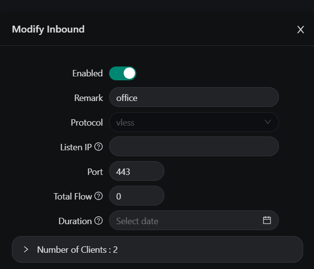
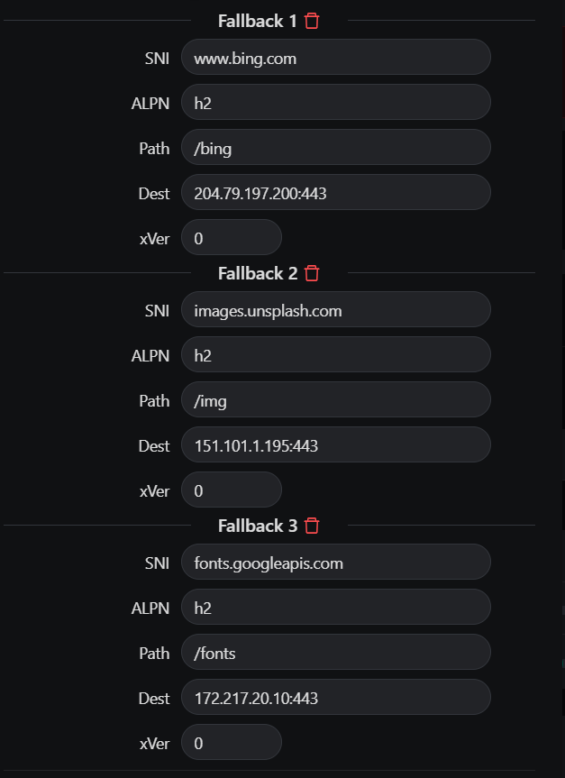
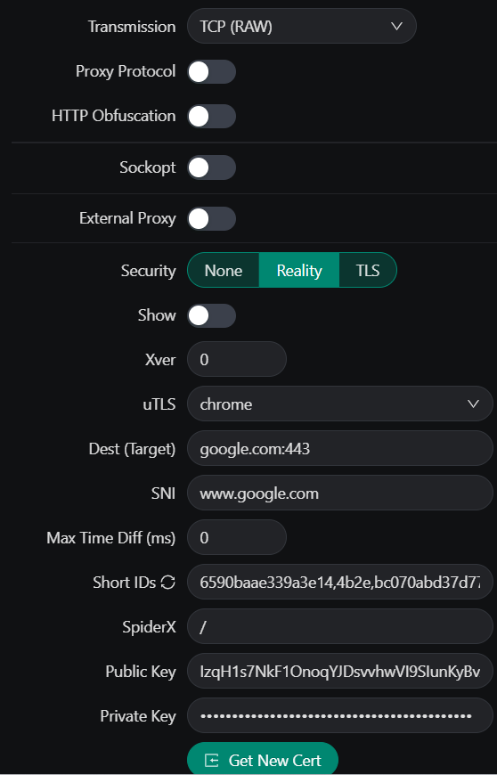
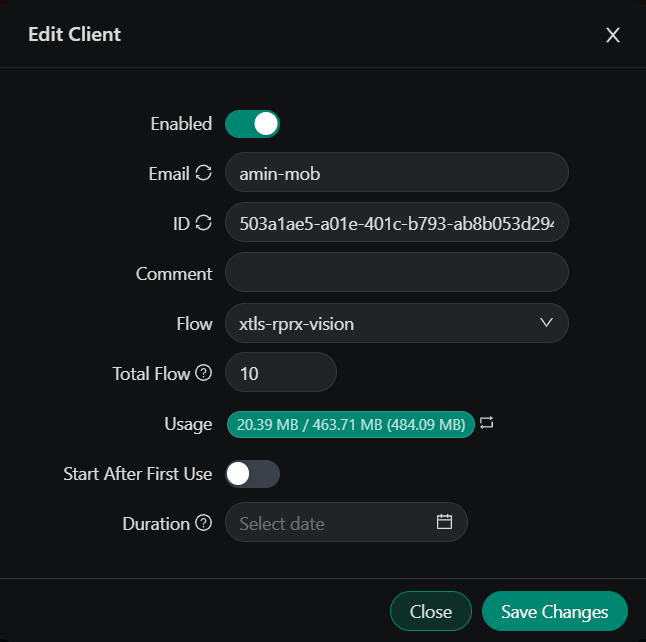

### install `x-ray` server
```
bash <(curl -Ls https://raw.githubusercontent.com/XTLS/Xray-install/main/install-release.sh)
```
### create config file
```
vim /usr/local/etc/xray/config.json
```
### generate uuid
```
uuidgen
```
### Content inside the config file
```
{
  "log": {
    "loglevel": "warning"
  },
  "inbounds": [
    {
      "port": 1895,
      "listen": "0.0.0.0",
      "protocol": "vless",
      "settings": {
        "clients": [
          {
            "id": "fa8c53f7-5e5d-4e48-b60c-0de8f09c9e91",
            "level": 0,
            "email": "client@myserver"
          }
        ],
        "decryption": "none"
      },
      "streamSettings": {
        "network": "tcp",
        "tcpSettings": {
          "header": {
            "type": "none"
          }
        }
      }
    }
  ],
  "outbounds": [
    {
      "protocol": "freedom",
      "settings": {
        "domainStrategy": "UseIP"
      },
      "tag": "direct"
    },
    {
      "protocol": "blackhole",
      "settings": {
        "response": {
          "type": "http"
        }
      },
      "tag": "block"
    }
  ],
  "dns": {
    "servers": [
      "1.1.1.1",
      "8.8.8.8",
      "223.5.5.5"
    ]
  },
  "routing": {
    "domainStrategy": "IPIfNonMatch",
    "rules": [
      {
        "type": "field",
        "domain": ["geosite:category-ads-all"],
        "outboundTag": "block"
      },
      {
        "type": "field",
        "ip": ["geoip:private"],
        "outboundTag": "direct"
      },
      {
        "type": "field",
        "domain": ["geosite:cn"],
        "outboundTag": "direct"
      },
      {
        "type": "field",
        "ip": ["geoip:cn"],
        "outboundTag": "direct"
      }
    ]
  }
}
```
### Add user
```
"clients": [
  {
    "id": "fa8c53f7-5e5d-4e48-b60c-0de8f09c9e91",
    "level": 0,
    "email": "client1@myserver"
  },
  {
    "id": "a9c2c3e0-467d-4f9a-a3cf-139f1f2091f7",
    "level": 0,
    "email": "client2@myserver"
  }
]
```
### Creating a VLESS connection link
```
vless://<UUID>@<IP>:<PORT>?encryption=none&type=tcp#<Name>
```
### status x-ray
```
systemctl status xray.service
journalctl -u xray -f
```

### Convert link to QRcode
```
apt install qrencode
qrencode -t ansiutf8 'vless://fa8c53f7-5e5d-4e48-b60c-0de8f09c9e91@ip:1899?encryption=none&type=tcp#V2Ray-TCP'
OR
https://www.qr-code-generator.com/

```
### To control users, you can use the `x-ui` version. It performs all the configurations separately
```
bash <(curl -Ls https://raw.githubusercontent.com/MHSanaei/x-ui/master/install.sh)
OR
bash <(curl -Ls https://raw.githubusercontent.com/MHSanaei/3x-ui/refs/tags/v2.5.8/install.sh)
https://github.com/MHSanaei/3x-ui
```




### Testing how the VPN is working properly
```
tcpdump -i eth0 port 443 -n
```
### marzban
```
https://github.com/Gozargah/Marzban
```

