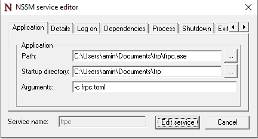

### Access to services behind NAT and firewalls from the Internet without static IP
### frp needs to be set up as a client and server
One service on the server with static ip
And one service needs to be run on each client
### Project address
```
https://github.com/fatedier/frp/tree/dev
```
### Installing and setting up `FRPS` on the server
```
wget https://github.com/fatedier/frp/releases/download/v0.62.1/frp_0.62.1_linux_amd64.tar.gz
```
```
[common]
bind_port = 7000
bind_udp_port = 7001
kcp_bind_port = 7000
dashboard_port = 7500
dashboard_user = "admin"
dashboard_pwd = "n2w;T6?USzADP}9Fu(b"
vhost_http_port = 8080
vhost_https_port = 8443
log_file = "/var/log/frps.log"
log_level = "info"
log_max_days = 7
authentication_method = "token"
token = "a7272ede386937244d0bab366b88"
max_pool_count = 5
allow_ports = "2000-65000"
tcp_mux = true
```
```
vim  /etc/systemd/system/frps.service

[Unit]
Description=FRP Server
After=network.target

[Service]
ExecStart=/home/frp/frps -c /home/frp/frps.toml
Restart=always

[Install]
WantedBy=multi-user.target
```
### create `token`
```
openssl rand -hex 16
```
### manual execution `frps`
```
./frps -c ./frps.toml
```
### Installation and setup on Windows client `frpc`
```
[common]
server_addr = "79.127.125.189"
server_port = 7000
token = "a72724a23386937244d0bab366b88"
log_file = "frpc.log"
log_level = "info"
[rdp]
type = "tcp"
local_iP = "127.0.0.1"
local_port = 3389
remote_port = 3389
```
### For automatic and reliable connection, we need to introduce it as a service using the `Nssm` tool
```
download https://colab.research.google.com/drive/1PBr-lz89TBSyOMZXe3_x6ucb2_EdEyoU
```
```
cd C:\Users\amin\Documents\nssm\win64
open CMD
nssm install frpc
```

### manual execution `frpc`
```
frpc.exe -c frpc.toml
```
### edit service with `nssm`
```
nssm edit frpc
OR
nssm --help
```
